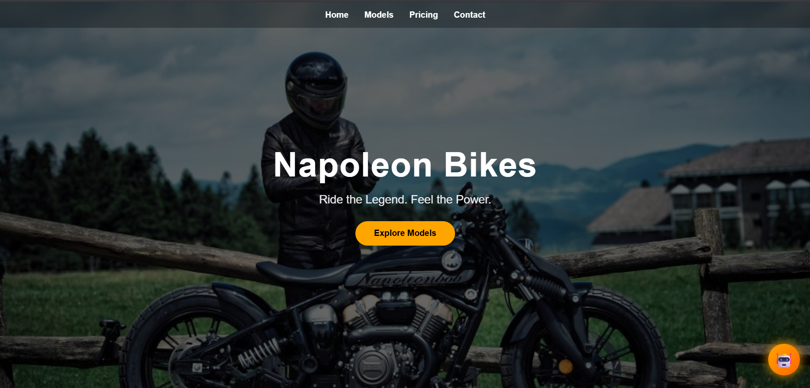
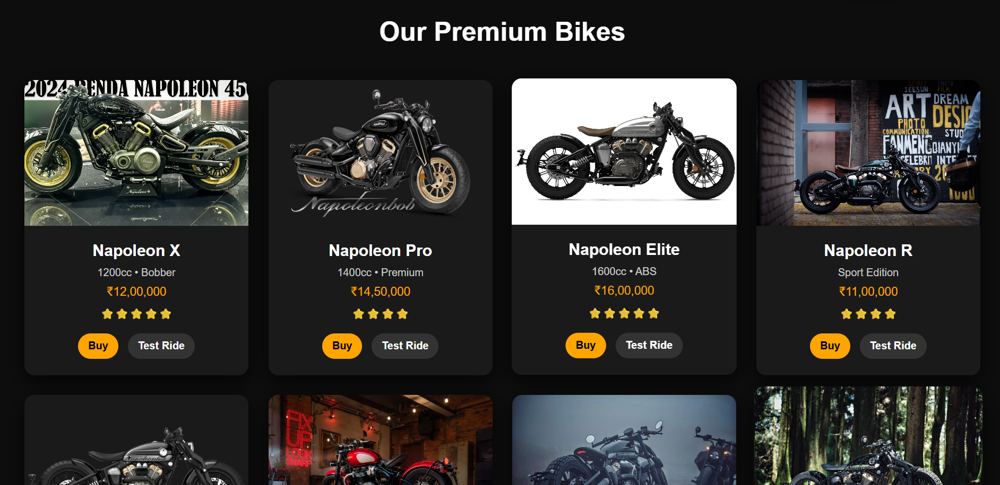
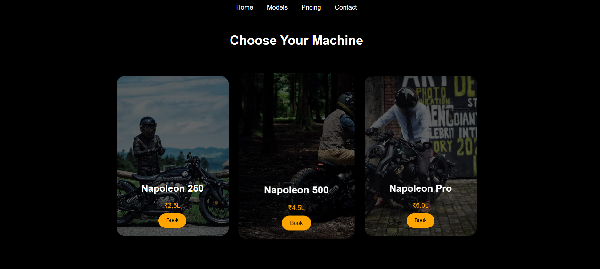
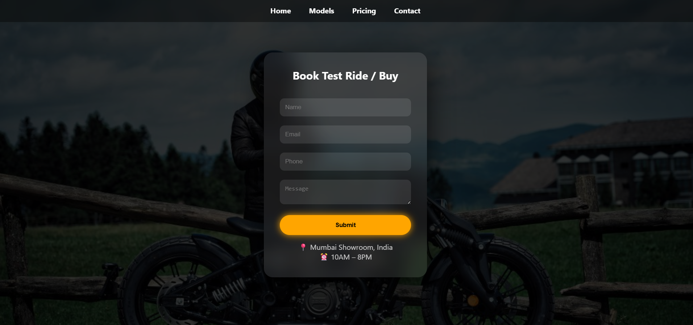
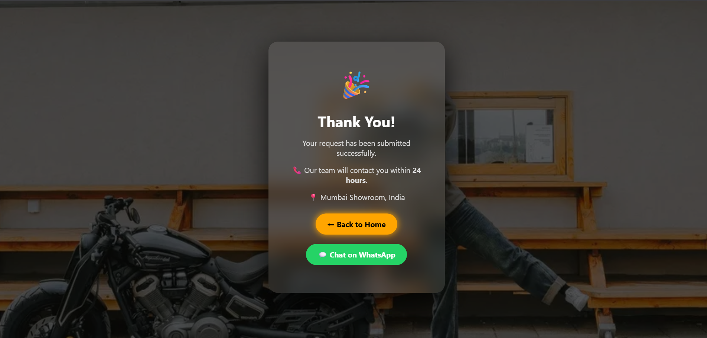

# 🚀 Napoleon Bikes – Full Stack Web App

<p align="center">
  
</p>

<h2 align="center">Ride the Legend. Feel the Power.</h2>

<p align="center">
  
  
  
</p>

---

## 🎥 Project Preview

<p align="center">
  
</p>

---

## ✨ Features

<p align="center">
  ⚡ Smooth • 🎨 Modern • 🚀 Fast • 📱 Responsive
</p>

- 🔥 Cinematic animated UI with premium effects  
- 🏍 Dynamic bike showcase experience  
- 💰 Interactive pricing section  
- 🤖 Smart chatbot (rule-based)  
- 📝 Booking & test ride system (PHP backend)  
- 🎉 Animated success page with confetti  
- 📱 Fully responsive across devices  

---

## ⚙️ Tech Stack

<p align="center">


<br><br>


</p>

---

## 📸 Screenshots

<p align="center">




<br><br>




<br><br>



</p>

---

## 📂 Project Structure

```bash
/api          → Backend (PHP)
/assets       → Images & media
/bikes        → Models page
/pricing      → Pricing UI
/contact      → Booking form
/thank-you    → Success page
